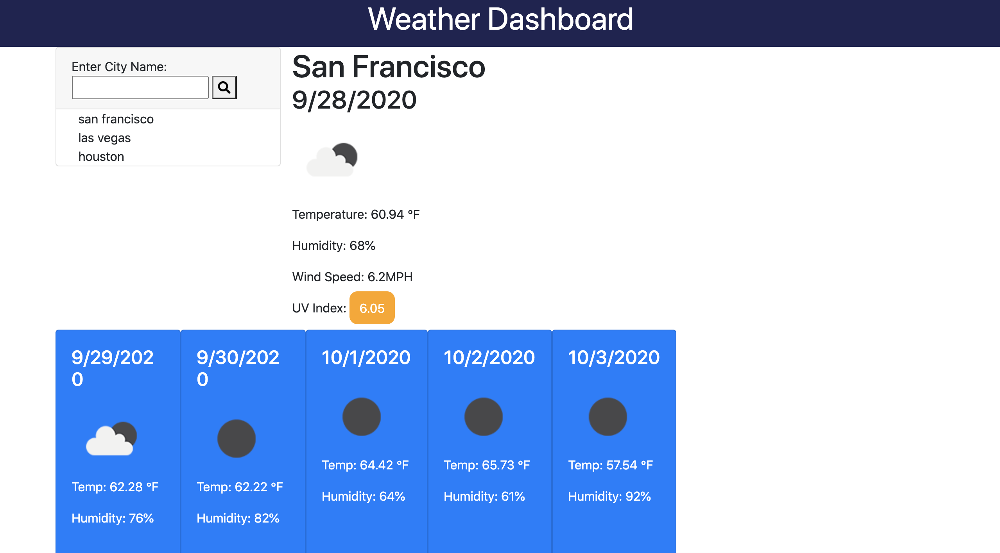

# Weather-Dash

Check a city's forecast with this weather web application! Check the humidity, temperature, wind speed, and UV index for the current day and the next 5 days. 

This web application consists of: 
 - Search bar for city 
 - Temperature in Farenheit
 - List of previous cities searched 

 ## Web application Image

 

 
 ## Built With
* HTML
* CSS
* JavaScript 
* JQuery
* OpenWeather API
* Git - version control system to track changes to source code
* GitHub - hosts repository that can be deployed to GitHub Pages

## Deployed Link

* [See Live Site](https://leslievill.github.io/Weather-Dash/)

## Authors

* **Leslie Villatoro** 
- [Link to Github](https://github.com/leslievill)
- [Link to LinkedIn](www.linkedin.com/in/leslie-villatoro-a3632a1a3)

## License

This project is licensed under the MIT License 
